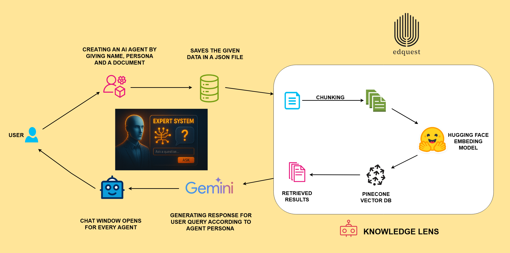

#  KnowledgeLens - Backend

This is the backend for the **KnowledgeLens AI Agent Platform**.  
It allows you to create, manage, and interact with AI chatbots powered by **LangChain**, **Pinecone**, and **FastAPI**.

---

##  Features
- Create and save AI agents with:
  - Name & persona
  - Knowledge base (PDF document)
  - Optional profile image
- Store agent metadata in `agents.json`
- Upload documents to Pinecone for vector search
- Query chatbots using RAG (Retrieval Augmented Generation)
- Delete agents (removes entry from JSON + Pinecone index)
- REST API endpoints with CORS support

---

##  Project Structure

backend/

│── agents.py                    # Agent creation and management logic

│── data_insertion.py            # Uploads documents to Pinecone

│── semantic_search.py           # Handles RAG / semantic search

│── main.py (API file)           # FastAPI app with endpoints

│── agents.json                  # Stores all agent metadata

│── uploads/                     # Stores uploaded PDFs/images

│── pyproject.toml               # Contains all the dependencies


## Workflow

1. The agent_name, agent_perona and document gets stored in the JSON file after creating the agent.

2. Document goes for -> Chunking -> Embedding Generation ->Stored in Vector DB

3. Retrieved results according to the user's query and gives a response according to persona using Gemini.


## Architecture Diagram



##  Installation

1. Clone the repository:

   ```bash
   git clone "github-repository-link-for_knowledgelens"
   cd GenAI-Studio/Backend/knowledgelens
   ```
2. Create a virtual environment & install dependencies:

```bash
uv init
uv venv  
.venv\Scripts\activate      

uv pip install .
```

3. Set up environment variables in .env:

PINECONE_API_KEY= "your_pinecone_api_key"

PINECONE_ENV=us-east1-gcp

GEMINI_API_KEY = "your_google_gemini_api_key"

4. Running the server

```bash
uvicorn main:app --reload
```

## API Endpoints

1. Creates an agent - POST /knowledgelens/saves_agents

Form-data:

agent_name: string

agent_persona: string

document: file (PDF)

agent_profile_image: file (optional)

2. Deletes agent metadata from agents.json - DELETE /knowledgelens/agents/{agent_name}

3. Chat with Agent - POST /knowledgelens/chat

4. Get the list of all the agents - GET/knowledgelens/agents

## Tech Stack

FastAPI

LangChain

Pinecone

HuggingFace Embeddings

PyPDFLoader


