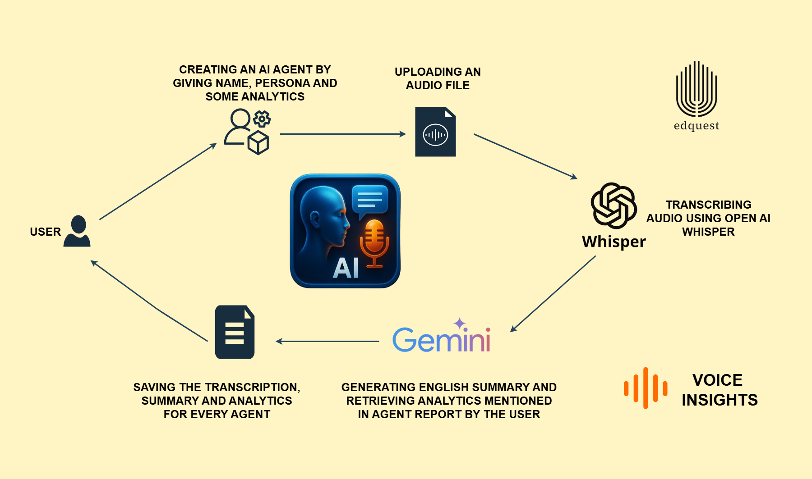

# VoiceInsights - Server-Side 

The **FastAPI backend** for the Voice Insights project.  
It handles audio transcription, AI-powered summarization, structured analytics, and agent data storage.


## 📂 Project Structure
```bash
Voice_Insights/
└── agents/              # JSON files storing per-agent call history 
├── app.py               # FastAPI app entry point
├── company.py           # Business logic (agent creation)
├── routesfile.py        # API endpoints (transcribe, summarize, agents)
├── services.py          # Business logic (transcription, summaries)
├── pyproject.toml       # Dependencies managed with uv
└── README.md            # Backend documentation


## Technologies Used

**Python**: The core programming language.

**Fast-API**: A lightweight web framework for building the API.

**Whisper (openai-whisper)**: OpenAI's powerful open-source speech-to-text model for robust transcription.

**Google Generative AI (google-generativeai)**: Python client library for interacting with Google's Gemini models.

**python-dotenv**: For managing environment variables.


## Setup and Installation

Follow these steps to get the SoundScript backend running on your local machine.

### Navigate to the Server Directory:

```bash
cd GenAI-Studio\Backend\Voice_Insights
```

### Create and Activate a Virtual Environment:

It's highly recommended to use a virtual environment to manage project dependencies.

```bash
uv init

uv venv
.venv/bin/activate # On Windows: .\venv\Scripts\activate
```

### Install Python Dependencies:

```bash
uv pip install .
```
This will install fastapi, Whisper, Google Generative AI, python-dotenv, and python-multipart.

### Download Whisper Model:

The whisper library requires a local model file. Download the base.pt model (or a larger one like small.pt or medium.pt for better accuracy, at the cost of disk space and processing time) from the official Whisper GitHub repository or by running a command like:


```bash
python -c "import whisper; whisper.load_model('base/small/medium/large-v3')"
```

Crucially, ensure the model_path variable in your app.py points to the correct local path where you have saved the .pt model file. For example:

```bash
model_path = "C:/WhisperModels/whisper/base.pt" # Example Windows path

model_path = "/home/user/.cache/whisper/base.pt" # Example Linux path
```

### Configure Gemini API Key:

Create a file named .env in this Server/ directory (same level as app.py and pyproject.toml) and add your Google Gemini API key:

```bash
GOOGLE_API_KEY="YOUR_GEMINI_API_KEY_HERE"
```

You can obtain a Gemini API key from the Google AI Studio.


## Running the Backend Server

Once all dependencies are installed, the API key is configured, add this path

```bash
cd GenAI-Studio\Backend\Voice_Insights
```

and then run the backend server

```bash
uvicorn app:main --reload
```

The server will typically run on http://127.0.0.1:8000. Keep this terminal open while using the frontend.


## project Workflow #########

1. Upload audio file

2. Backend transcribes audio

3. AI generates structured summary + sentiment analysis

4. Data saved in JSON file under /agents/

5. Frontend fetches & displays results

## API Endpoints

The backend provides the following endpoints:

* POST /agents/create → Create a new agent with name, persona, and report.

* GET /agents → List all agents with details:agent_name, agent_persona, agent_report, audios_count

* POST /audio/transcribe → Upload audio & get transcription

* POST /audio/summarize → Generate AI-powered summary & analytics

* GET /agents/{agent_name}/transcriptions → Fetch agent’s transcriptions & analytics

##### Architecture Digram ####

