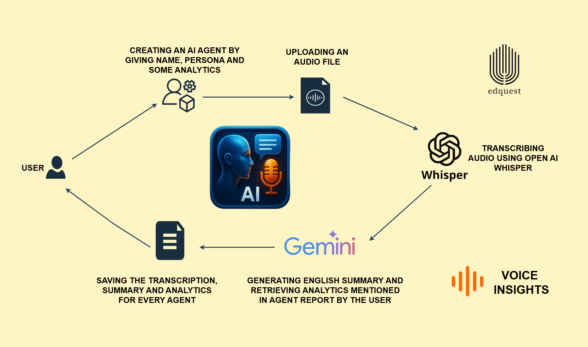

# Voice Insights Frontend

The **React frontend** for the Voice Insights project.  
Provides UI for uploading audio, viewing transcripts, structured summaries, and analytics.

---

## ⚙️ Tech Stack
- **Framework:** React.js (18+)
- **Styling:** CSS (per component)
- **State Management:** React Context
- **API Communication:** Fetch / Axios (backend: `http://localhost:8000`)


#### project structure ######

```plaintext
Voice_Insights/
├── src/
│   ├── AgentDetail.css        # Styles for Agent Detail page
│   ├── AgentDetail.js         # Component for viewing agent details
│   ├── App.css                # Global App styles
│   ├── App.js                 # Main App component with routes
│   ├── App.test.js            # Tests for App component
│   ├── CreateAgentModal.css   # Styles for Create Agent Modal
│   ├── CreateAgentModal.js    # Modal component for adding a new agent
│   ├── createContext.js       # Global React Context for state management
│   ├── dashboard-graph.jpeg   # Dashboard graph asset
│   ├── Dashboard.css          # Styles for Dashboard
│   ├── Dashboard.js           # Dashboard UI component
│   ├── FullAnalyticsData.css  # Styles for Full Analytics Data
│   ├── FullAnalyticsData.jsx  # Component to display analytics data
│   ├── index.css              # Global styles
│   ├── index.js               # React entry point
│   ├── Login.css              # Styles for Login page
│   ├── Login.js               # Login component
│   ├── logo.svg               # App logo asset
│   ├── Navbar.css             # Styles for Navbar
│   ├── Navbar.js              # Navigation bar component
│   ├── reportWebVitals.js     # Performance measuring utility
│   ├── RequireAuth.js         # Component to protect private routes
│   ├── setupTests.js          # Test configuration file
│   ├── Upload.css             # Styles for Upload page
│   ├── Upload.js              # File upload component
│   ├── useAuth.js             # Custom React hook for authentication
│
├── package.json               # Project dependencies & scripts
├── package-lock.json          # Auto-generated lock file
└── README.md                  # Project documentation

```


### Install Dependencies:

```bash
npm install # or yarn install
```

If you don't have npm or yarn installed, please install Node.js (which includes npm) or Yarn first.

### Ensure Backend is Running:

The frontend communicates with a backend API (Flask server). Make sure your backend server is running, typically on http://127.0.0.1:8000, before starting the frontend. Refer to the Server/README.md for backend setup instructions.

### Start the Development Server:

```bash
npm start # or yarn start
```

This will open the application in your default web browser, usually at http://localhost:3000.

##### Workflow ####

* Select or create an Agent

* Upload audio file → sent to FastAPI backend

* Receive transcription + AI summary

* View structured analytics


#### Architecture Daigram ###############################


